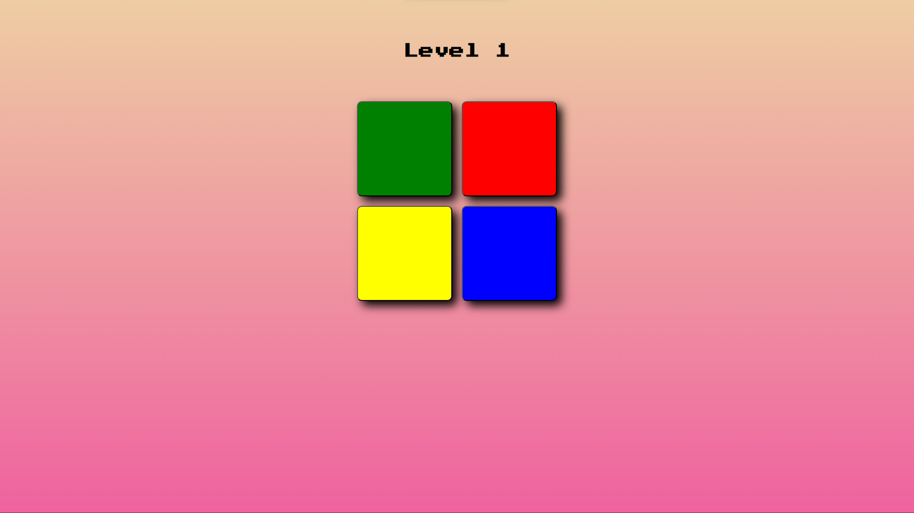

# Simon Game

## Description

Welcome to the Simon Game! This project is a digital implementation of the classic Simon game, built using jQuery, HTML, and CSS. The game tests your memory as you follow the pattern of colored lights and sounds generated by the computer.

## Features

- Classic Simon game mechanics.
- Aesthetically pleasing design.
- Interactive gameplay with sounds and animations.

## Technologies Used

- **jQuery:** Used for DOM manipulation and event handling.
- **HTML:** For structuring the content of the web pages.
- **CSS:** Styling to enhance the visual appeal.

## How to Play

1. Clone this repository:

    ```bash
    git clone https://github.com/roshan21k/simon.git
    ```

2. Open the `index.html` file in your web browser.

3. Follow the pattern of colored lights and sounds generated by the computer.

4. Repeat the pattern by clicking on the colored buttons.

5. The game becomes progressively challenging as you successfully complete each round.

Play Now at [Simon Game](https://roshan21k.github.io/simon/)

Feel free to enjoy the classic Simon Game experience!


## Screenshots


